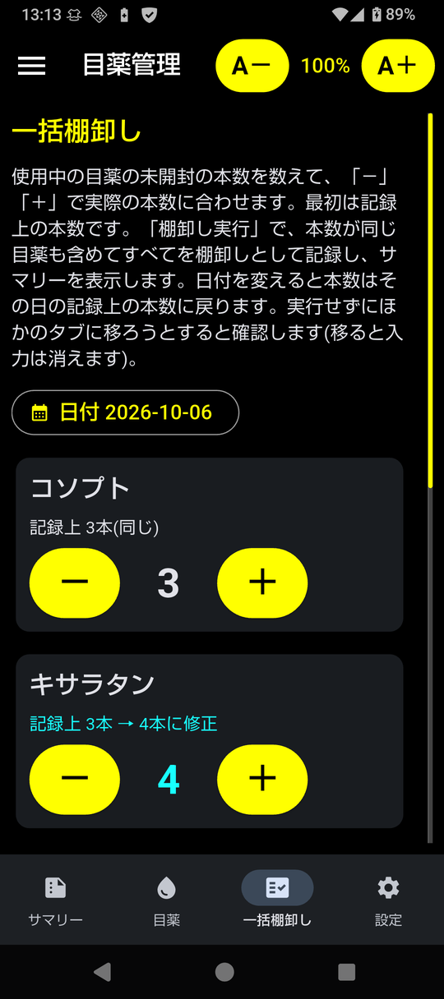

# eyedrop

An Android app and command-line tool that tracks eye drop stock and estimates
how many bottles to ask for at your next eye doctor visit.
The user interface and documentation are in Japanese.

| Summary | Stock | Eye drops | Detail | Bulk stocktaking |
|---|---|---|---|---|
|  |  |  |  |  |

## Features

- Records prescriptions, opened bottles and stocktaking
- Bulk stocktaking before a visit: recount all eye drops in use on one screen
- Estimates how many days one bottle lasts from recent usage
- Calculates the bottles needed until the next visit, with the basis of the calculation
- Backup and restore; the Android app works offline with its own data

## Install (Android)

Download `eyedrop.apk` from [Releases](../../releases) and install it
(Android 7.0 or later, arm64-v8a).

Signing certificate: `CN=kuma35`, SHA-256
`97:4A:8A:A3:16:77:C6:CF:66:BA:03:AE:A0:47:88:37:CB:A8:07:05:83:62:6D:FD:34:35:8F:32:19:23:4D:A0`

## Command-line version

Requires Python 3.9 or later (standard library only; tested with 3.9 to 3.14).

```sh
git clone https://github.com/kuma35/eyedrop.git eyedrop
cd eyedrop
./install.sh        # installs ~/bin/eyedrop and ~/share/man/man1/eyedrop.1 (PREFIX=... to change)
eyedrop help
man eyedrop
```

The database is `~/.local/share/eyedrop/eyedrop.db` by default.

`eyedrop-sample.db` is sample data. Copy it before use, as opening it updates the file.

## Documentation

Detailed documentation (in Japanese): https://kuma35.github.io/eyedrop/

## License

MIT License. See [LICENSE](LICENSE).

## Disclaimer

This tool only gives an estimate. Always follow your doctor's instructions.
