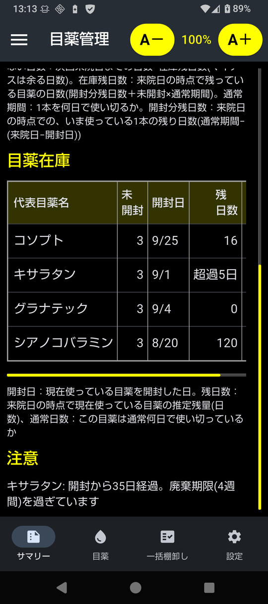
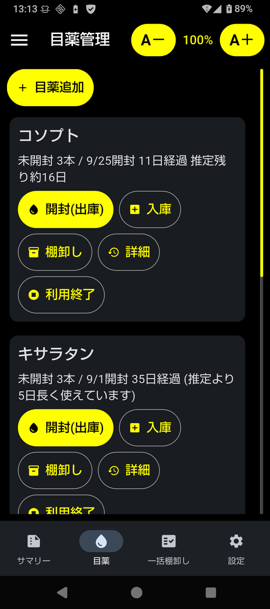
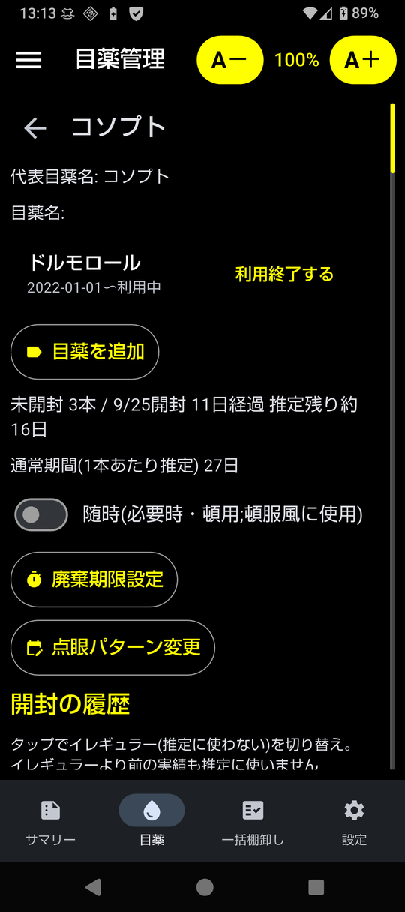

=========================
Android版
=========================

個人で Google Play に登録するのは大変なので、いわゆる野良APK です。
データは端末の中だけにあり、ネットワークは使いません。

動作環境
========

- Android 7.0 以上
- 64bit の ARM 端末(arm64-v8a)。スマホ・タブレットとも可
- 実機で確認したのは Android 16(シャープ AQUOS sense8)と Android 10(TECLAST M40 タブレット)

インストール
============

GitHub の Releases から ``eyedrop.apk`` をダウンロードし、次のどちらかでインストールします。

**スマホで直接インストールする**

1. スマホのブラウザで ``eyedrop.apk`` をダウンロード
2. ダウンロードした ``eyedrop.apk`` をタップ
3. 「この提供元のアプリを許可」を求められたら、ブラウザ(またはファイルアプリ)に許可してインストール

**PC から USB 経由でインストールする**

1. スマホで「設定 → デバイス情報 → ビルド番号」を7回タップし、開発者向けオプションで「USB デバッグ」をオン
2. スマホを USB で PC につなぎ、「USB デバッグを許可」で許可
3. PC で次を実行(``adb`` は Android SDK Platform-Tools に含まれます)

.. code-block:: sh

   $ adb install -r eyedrop.apk

インストール直後はデータが空です。「目薬」タブで目薬を追加するか、
バックアップ(または CLI版の ``eyedrop.db``)を「設定」タブの「ファイルから復元」で取り込みます。
アプリを上書きで更新してもデータは消えませんが、機種変更などに備えて
「設定」タブの「ファイルに保存」でときどきバックアップしてください。

署名の確認(フィンガープリント)
================================

配布している APK は次の証明書で署名しています。
ダウンロードした APK が本物かどうかは、証明書の SHA-256 フィンガープリントがこれと一致するかで確かめられます。

- 証明書: ``CN=kuma35``
- SHA-256: ``97:4A:8A:A3:16:77:C6:CF:66:BA:03:AE:A0:47:88:37:CB:A8:07:05:83:62:6D:FD:34:35:8F:32:19:23:4D:A0``

確認には Android SDK Build-Tools の ``apksigner`` を使います(``keytool -printcert -jarfile`` では読めません)。

.. code-block:: console

   $ apksigner verify --print-certs eyedrop.apk
   Signer #1 certificate DN: CN=kuma35
   Signer #1 certificate SHA-256 digest: 974a8aa31677c6cf66ba03aea0478837cba8070583626dfd34358f3219234da0
   ...

画面と使い方
============

画面は下部のタブで切り替えます。画面の例は :doc:`サンプルデータ <sample>` で、次回来院日を4ヶ月後にしたものです。
画面上部の「A－」「A＋」で文字の大きさを変えられます。

サマリー
--------

.. image:: ../images/summary.png
   :width: 270
   :alt: サマリー

来院日(既定は今日)と次回来院日(既定は来院日の2ヶ月後)を表示し、
次回来院までに必要な本数を目薬ごとに計算します。
来院日・次回来院日は押すとカレンダーで変えられます。
表は横にスクロールでき、必要本数に続いて根拠(足りない日数・在庫残日数・未開封・通常期間・開封分残日数)を表示します。
計算のしかたは :doc:`estimate` を参照してください。

下にスクロールすると「目薬在庫」(未開封の本数、開封中の1本の開封日・推定残日数、通常何日で使い切っているか)と、
廃棄期限を過ぎているなどの「注意」があります。
左上のメニューから、サマリーを Markdown・テキスト・チャットAI 用でコピーできます。

目薬
----

目薬ごとのカードで、次の操作をします。

- **開封(出庫)**: 新しい1本を在庫から出して使い始める。使っていた1本は使い切りとして記録
- **入庫**: 処方された本数を記録
- **棚卸し**: 未開封の本数を数え直したときに記録
- **詳細**: 目薬名・開封の履歴・在庫の履歴など
- **利用終了**: その目薬(代表目薬名ごと)を使わなくなったとき

上の「目薬追加」で新しい目薬を登録します。

目薬の詳細
----------

- **目薬名**: ジェネリックなどで実際にもらう目薬の名前が変わったら「目薬を追加」。
  代表目薬名(例: コソプト)はそのままで、目薬名(例: ドルモロール)を追加・利用終了できます
- **随時**: 毎日ではなく必要なときに使う目薬。必要本数を計算せず在庫だけ表示します
- **廃棄期限設定**: 「開封後4週間で廃棄」などの目安。過ぎると「注意」に表示します
- **点眼パターン変更**: 1日の点眼回数などが変わったとき。直近の1本をイレギュラーにし、
  それより前の実績を推定に使わないようにします
- **開封の履歴**: タップでイレギュラー(推定に使わない)を切り替えます。
  一番新しい開封は取り消せます

設定
----

バックアップ(ファイルに保存・共有で送る)、ファイルから復元、年次更新、
次回来院日の既定の期間、表示(黒地に白)を設定します。

ビルド
======

Linux(Ubuntu 24.04 で確認)で APK を作る手順です。ビルドする PC には Python 3.10 以上が必要です
(スマホには Python は不要です。APK に同梱されています)。

.. code-block:: console

   $ git clone <リポジトリの URL> eyedrop
   $ cd eyedrop
   $ python3 -m venv venv
   $ venv/bin/pip install -r requirements.txt
   $ cd mobile
   $ ../venv/bin/flet build apk --yes --arch arm64-v8a    # → build/apk/eyedrop.apk
   $ ~/Android/sdk/platform-tools/adb install -r build/apk/eyedrop.apk   # USB でつないだスマホへ

- 初回のビルドは Flutter・JDK・Android SDK を自動で取り込むので時間がかかります(Android SDK は ``~/Android/sdk``)
- 32bit の ARM 端末向けには ``--arch armeabi-v7a`` で作ります
- APK は PC の開発用の鍵(``~/.android/debug.keystore``、自動作成)で署名されます。
  上書き更新には同じ鍵で署名した APK が必要です。配布版の APK を入れたスマホに自分でビルドした APK を入れるときは、
  先にバックアップを取ってアンインストールしてから入れ、「ファイルから復元」でデータを戻してください
