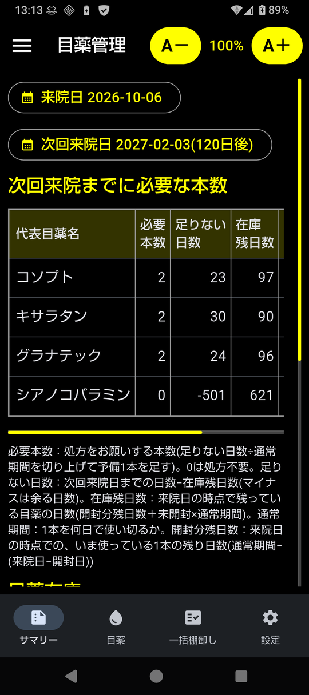

=================================
目薬管理(eyedrop)
=================================

眼科の受診時に、次の受診までに必要な目薬の種類と本数を算出する
Android アプリとコマンドライン(CLI)ツールです。

経緯
====

複数の目薬を使っていて、ある目薬は朝・夕両方、別の目薬は夕だけなど、
点眼パターンが違うと、目薬ごとに消費量も異なります。
手元の在庫、目薬1本を通常何日で使い切るのか、今使っている目薬があと何日もつかを
把握した上で、次の受診日までに何本欲しいかを伝えないと、
ダブついたり、次の受診までに足りなくなったりします。

このプログラム・アプリでは、目薬の入出庫と、使用中の目薬の残日数を管理し、
来院日と次回来院日から、次回来院日までにそれぞれ何本の目薬が必要かを算出します。

できること
==========

- **在庫管理**: 入庫(処方)・出庫(開封)・棚卸しを記録し、未開封の在庫数を把握
- **ライフタイム管理**: 開封日を記録し、1本が何日もつか(通常期間)を過去の実績から推定。
  いま使っている1本の推定残日数を表示
- **次回来院までに必要な本数**: 来院日(既定は今日)から次回来院日
  (既定は2ヶ月後。日付や「4週間」のような期間で変更可)までに、
  処方をお願いする本数を計算し、根拠(足りない日数・在庫残日数・未開封・通常期間・開封分残日数)も表示。
  1本程度の予備を見込む
- **書き出し**: Markdown・テキスト・チャットAI 用(指示 + JSON)。
  Evernote などにそのまま貼り付けられる
- **年次更新**: 古い記録をバックアップ・CSV に書き出し、在庫を繰り越す

特徴
====

- 「たまたま短かった1本」や「途中で中断した1本」で推定が狂わないよう、
  イレギュラーな記録を除外できます。1日の点眼回数などが変わったときは
  「点眼パターン変更」で、それより前の実績を使わないようにできます
- キサラタンのように「開封後4週間で廃棄」の目安がある目薬は、
  廃棄期限を過ぎると知らせます(推定そのものは実績どおり)
- ヒアレインのように **随時使う目薬** は、必要本数を計算せず在庫だけ表示します
- Android版は目が悪くても見やすいよう、既定は黒地に白の高コントラストで、文字は大きめです

データは Android版、CLI版それぞれに保持していて共有しません。
Android版の変更が自動で CLI版に反映されることはありませんし、その逆もありません
(バックアップのファイルで移すことはできます)。

.. toctree::
   :maxdepth: 2
   :caption: 目次

   android
   cli
   estimate
   sample

ライセンス
==========

MIT License です。

注意
====

このツールは目薬の点眼の記録と、受診時に伝える目薬の本数の目安を出すためのものです。
実際の処方や点眼の方法は、必ず医師の指示に従ってください。
